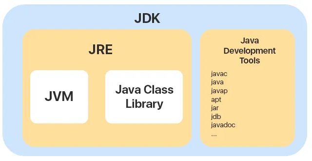

# 혼공자 한바퀴… (1)

# 자바의 구조 …

- 중점적으로 공부할거
    
    Wrapper , stream , 상속 , 인터페이스 , util 클래스 메소드
    


- 자바의 구조를 알아보자!
    
    ---
    
    ---
    
    
    
    ### JDK , JRE , JVM 어떤 개념인지 아시나요?
    
    - 자바를 사용하면서 자바가 어떤식으로 동작하는지 모르면..?
        
        자바의 일단 틀을 아는것이 중요할 것 같다.
        
    
    ### JDK - Java Development Kit 의 약자이다 .
    
    > JDK 는 자바 개발 키트의 약어 , 개발자들이 자바로 개발하는데 사용되는도구
    > 
    
    목수는 독일제 공구 , 음악가는 뛰어난 악기가 필요하듯 .
    
    자바를 개발하는데 있어서 필요한 도구도 버전이 있다 . 자바도 업데이트를 통해 도구를 발전시켜 나가는데 , 
    
    현재 우리가 쓰는 openJDK 17 버전 이전 8 버전부터 람다식 과 , 시간 API ( 자바 초기버전 시간 구현은 지옥같았다..) 등 기능이 생기는 것을 보면 …. 싱기하다 .. 
    
    그리고 자바 21 버전부터 UTF -8이 기본값으로 들어간다고 한다…
    
    ---
    
    ---
    
    ### JRE - Java Runtime Environment
    
    > JRE는 자바 실행 환경의 약어이다 . JVM 과 자바 프로그램을 동작 시킬때 필요하다.
    > 
    
    JRE는 자바 프로그램을 동작 시킬때 필요한 라이브러리 API를 묶어서 배포하는 패키지이다.
    
    JDK 라는 좋은 연장이 있으면 그 연장을 사용할 사람이 필요한데, 자바에선 JRE가 사람의 역할을한다.
    JRE는 JDK를 설치할때 함께 설치된다. 
    **JRE는**  **개발된 프로그램을 실제로 구동시키는 역할**을 한다.
    
    ---
    
    ---
    
    ### JVM- Java Vitrual Mechine
    
    > JVM은 자바 가상머신의 약어이다 . 자바를 돌리는 프로그램이다 .
    > 
    
    JVM은 신기한 역할이 있다. 
    
    C코드를 윈도우 환경에서 짜고 리눅스 환경에서 실행하면 오류가난다… ( C 언어의 종속성 )
    
    우리나라사람도 제주도 사람과 같은언어인 한글을 쓰지만 제주도 사투리를  알아듣기 힘들다..
    살아온 환경이 다르기때문에 말을 이애할 수 없는 것 이다….
    하지만 자바는 JVM 이라는 테크 놀로지로 어느 운영체제 환경이던 서로 알아 먹을 수 있게 ( 각운영 체제에 맞는 전담 통역사를 붙임 ) 
    
    통역을 제공하여 소통을 가능하게 해준다…!
    
    - 설명하자면
    
    소스코드를 받으면 → JDK 컴파일러로 바이트코드로 변환 → JVM 실행 → 통역 ( OS에 맞게 해석 ) 
    

---

---

- 모든 언어의 시작, 변수와 타입  // 기본타입과 참조타입의 차이에 대해 보겠다.
    
    ### 변수
    
    <aside>
    ❓
    
    우리는 살아오면서 변수라는 말을 많이 들어봤을 것이다…
    
    이건 ..변순데…?…등등
    
    수학때문에 익숙할 것이고 … x , y , z 등, 여러가지 값으로 변할 수 있는 수, 
    지금은 데이터를 저장하는 공간으로 사용하고 있다.  
    
    </aside>
    
    ---
    
    ---
    
    ### 변수의 선언
    
    
    
    우리는 변수를 선언하려면 변수의 Type 과 변수 명을 선언한다. 
    
    Int age ;  를 변수라고 할 수 있을까? 
    
    변수에는 값이 들어가야 변수로서 선언이 되었다고 할 수 있다. 
    
    Int age = 25;  이런식으로 말이다 .  
    
    근데 Int age = 25  코드 전체를 ”변수” 라고 할수 있을까?
    
    **int** 는 기본 타입이다 . 기본 타입은  int 외 많이 있다.
    
    **age** 는 25 를 저장하는 **변수명**, 
    
    값 25는 변하지 않는 불변성을 가진 **리터럴**이다..!
    
    변수를 통해 리터럴 값을 저장하고 필요에 따라서 변경도 가능하다. 
    
    **리터럴은 변수와 달리 값을 직접 가리킨다.**
    
    즉 리터럴은 값 자체를 의미하고 변수는 리터럴 값을 저장하는 공간을 의미한다.
    
    <aside>
    🚨
    
    아! 그러면 이런 코드도 다 리터럴이구나 !? 리고 내가 생각 했었다
    
    StringTokenizer tokenizer = new StringTokenizer(data, ",");  
    
    아니다! 
    StringTokenizer 는 타입 tokenizer 는 변수  맞다 . 정확히는 자바에서 만들어둔 클래스,
    
    클래스의 이름이 타입이 되는 것이다.
    
    new StringTokenizer(data, ",");  그러면 당연히 리터럴이겠네?
    
    new 는 연산자로서 메모리 (Heap) 에 새로운 공간을 할당하는 역할을 한다 .
    
    리터럴은 동적으로 공간을 할당 하지 않는다.
    
    StringTokenizer 객체를 초기화하는 “함수” 이다
    
    쉽게 생각하면
    
    String str= “halo” 는 고정된 값 이므로 리터럴.
    
    String str = new String(”halo”) 는 new를통해 메모리에 매핑이 됐으므로 객체 이다.
    
    </aside>
    
    ---
    
    ---
    

---

---

- 쉬워보이지만 막상 쓰려고하면 기억이 안나는 연산자
    
    ### 연산자
    
    <aside>
    ➕
    
    연산자는 수학에서 산술,비교 등 .. 많은 연산자로 배워서 익숙하지만 
    
    프로그래밍 언어에서는 뭔가 미묘하게 달라서 헷갈리니 정의만 빠르게 잡고가겠다.
    
    </aside>
    
    - 연산자에는 여러가지 종류가 있다.
        - 산술 , 대입 , 증감 , 비교 , 논리 , 삼항….
    
    ### 산술 연산자
    
    일반적으로 알고 있는 연산자 제외, 
    
    (  /  ) 나눗셈과 (  %  ) 나머지 구별하기…!
    
    ### 삼항연산자
    
    > 삼항 연산자는 조건 연산자의 한 종류이다, if - then - else 조건문 과 같은 연산을 수행한다.
    > 
    
    ### 예제
    
    ```java
    int a = 50, b = 100 , c = 0;  
    
            // 일반 if-else문 사용
            if(a > b){
    		        int c = 10 ; 
                c = a - b;  // cs,는 -50 
            }else{
                c = b - a;  // 50 
            }  // 정재우님 나이스 스코프
            System.out.println(c); // c = 50
    
            // 삼항 연산자 사용 삼항 연산자안에도 조건을 걸 수 있다
            int d = (a > b) ? a - b : b - a;
            System.out.println(d); // d = 50
            
    	   //기본 형태는   조건         True           false
            result = (condition) **? valueIfTrue : valueIfFalse ;**
    ```
    
    **※ 생각해보기**
    
    for (int count = 0; count < 123;  ++count)
    
    for (int count = 0; count < 123 ; count**++**)
    
    2개의 for 문이 있다 . 증감연산자의 위치에 따라서 값에 차이가 있을까?
    
    - 생각…
        
        다른 연산과 함께할때 , 혹은  다른 연산이 포함 됐다면 …?
        
        for문같이 단독적으로 됐다면.. 차이가 없다..   증감자위치 따라서 생각
        

---

---

- 제어문 … 특히 배열의 친구 조건문
    
    ### 조건문
    
    > 조건문은 조건에 따라 다른 실행문을 실행하는게 목적이다.
    > 
    
    조건문의 종류에는 if 문 , switch 문이 있다. 
    
    ### IF문
    
    if문은 조건식의 결과가 true , false 이냐에 따라 ,실행문이 결정됨..!
    
    If문은 "조건이 맞으면 하고, 아니면 그냥 안함”
    
    편의점에 콜라사러갔는데 콜라가 없으면 그냥 나오는 것임
    
    
    
    ### IF-Else문은
    
    편의점에 콜라를 사러갔는데 “콜라가 있다면 콜라를 사고 , 없으면 사이다를 사는것”
    
    `int money = 500;`
    
    `// if-else를 사용 
    if (money >= 1000) {
    System.out.println("빵을 먹자 냠냠.");
    } else {
    // 조건이 거짓이면 여기가 무조건, 반드시! 실행됨 if 문과 다른점
    System.out.println("껌을 사먹는다.");
    }`
    
    `System.out.println("집에 간다.");
    // 결과: "껌을 사먹는다." , "집에 간다."`
    
    ### switch문
    
    switch 문은 변수의 값에따라 실행문이 결정됨...!
    
    스위치문도 if 문과 마찬가지로 조건 제어문이다 . 하지만 switch 문은 if 처럼 true or false로 블록 내부의 실행문을 실행하는 것이 아님. 
    
    if는 조건식이 2가지 ( T, F ) 밖에 없기 때문에 경우의 수가 많아질 수록 else - if 문을 추가해야해서 코드가 복잡해짐 .  
    
    하지만! switch 문은 변수가 어떤 값을 가지느냐에 따라서 실행문이 결정!
    
    Switch 문을 실행하는데 중요한 키워드가 있는디
    
    - Switch ( 변수 )
    - case 값 :
    - break ; 브레이크 안걸면 아래 조건문까지 다 실행함
    - default : else 와 같은 역할임 , 일치하는 케이스가없다면 실행된다
    
    ```java
    Scanner sc = new Scanner(System.in)
    
    int num = sc.nextInt()
    
    int num = 2; // 사용자가 누른 버튼 번호
    
    switch (num) {
        case 1:
            System.out.println("콜라가 나왔습니다.");
            break; // 자~ 나가자~
    
        case 2:
            System.out.println("사이다가 나왔습니다."); // 여기 실행됨
            break; 
    
        case 3:
            System.out.println("환타가 나왔습니다.");
            break;
    
        default:
            System.out.println("없는 버튼입니다. 동전을 반환합니다.");
    }
    ```
    
    
    
    굳이 굳이 ..  brake 가 고장난 8t truck 마냥 스위치 문을 쓰는 경우도 있다..
    
    ```jsx
    Scanner sc = new Scanner(System.in)
    
    int num = sc.nextInt()
    
    int num = 2; // 사용자가 누른 버튼 번호
    
    switch (num) {
        case 1->
            System.out.println("콜라가 나왔습니다.");
            break;
    
        case 2:
            System.out.println("사이다가 나왔습니다."); // 여기 실행됨
            
    
        case 3:
            System.out.println("환타가 나왔습니다.");
            
    
        default:
            System.out.println("야무지게 먹어야지~");
    }  향상된 스위치문 
    2번을 누르면 사이다 ,환타 등등 나올 수 있게 설정도 가능하다
    ```
    
    ### While 문
    
    > For문은 정해진 횟수만큼 실행 된다면 While문은 조건문이 true이면 계속 실행된다.
    > 
    
    
    
    ### do-while문
    
    > while 문 , do -while 문의 차이를 알아보자
    > 
    
    일반 반복문은 특정 조건이 맞아야 안에 있는 코드가 실행되는데
    
    do-while 문은 반드시 한번은 코드가 실행된다.
    
    굳이 do 안에 코드를 넣는 이유가 뭘까 생각하기  // 다음기회에
    
    
    
    ### 중지는 어떻게 ..?
    
    break 문은 반복문인 for문 , while , do-while 문의 실행을 중지할 때 사용 
    

---

---

- 피드백
    
    ### UTF-8 표준
    
    UTF-8은 전자통신에 사용되는 인코딩 표준~
    Unicode Transformation Format – 8-bit 에서 유래 되었다고 합니다~
    
    ### 향상된 스위치문
    
    > JAVA 14 버전부터 사용가능한 향상된 Switch 문
    > 
    - 기존의 Switch문과 비교하여 몇가지 기능이 추가되었다.
    
    ```java
    int day = 1; // 테스트값
    String dayOfWeek = switch (day) {
    case 1 -> "Monday";
    case 2 -> "Tuesday";
    case 3 -> "Wednesday";
    case 4 -> "Thursday";
    case 5 -> {
    						System.out.println ("오늘은 금요일입니다")
    						yield "Friday";
    						// 오늘은 금요일입니다" -> 블록안의 println 실행 -> 다음코드 yield ?
    						// 다른케이스는 왜 yield 가 안붙어있냐?
    						// 항상된 스위치에서는 한줄짜리는 알아서 해주는데 중괄호 열리면
    						// return 같은느낌으로 식별자 yield 예약어를 넣어야 반환을 해줌
    };
    default -> "Unknown";
    };
    System.out.println(dayOfWeek);
    
    각 case 문의 실행 코드 뒤에 -> 화살표 연산자를 사용하여 실행문 지정가능
    
    만약 기존 스위치문으로 실행했다면?
    
    int day = 1; // 테스트값임
    String dayOfWeek;
    
    switch (day) {
        case 1: 
            dayOfWeek = "Monday"; // 값을 직접 할당해야함
            break; 
        case 2:
            dayOfWeek = "Tuesday";
            break;
        case 3:
            dayOfWeek = "Wednesday";
            break;
        ... 생략
    }
    
    System.out.println(dayOfWeek);
    -----------------------------------------------------------------------------------
    ```
    
    <aside>
    🤸‍♂️
    
     장점!!! 
    1. 콜론 대신 화살표를 사용하여 간단하게 구현가능 , 
    2.break 문 생략가능!
    3.향상된 switch문은 결과값을 바로 변수에 담을 수 있지만,
    
    기존방식은 미리 선언된 변수에 값을 하나하나 넣어줘야한다.
    
    </aside>
    
    ### 클래스와 객체 인스턴스
    
    > 목표는 클래스 , 객체 , 인스턴스의 개념을 설명하는 것 .
    > 
    
    ### **Class**
    
    - 개념
        - 객체를 만들어 내기위한 설계도 or 틀
        - 연관 되어있는 변수 ( field ) 와 메서드의 집합
    
    ### **객체 ( Object )**
    
    - 개념
        - 소프트웨어에 구현할 대상
        - 클래스에 선언된 그대로 생성된 실체
    - 특징
        - 클래스의 “ 인스턴스 “ 라고 부릅니다
        - 객체는 모든 “인스턴스” 를 대표하는 포괄적인 의미를가짐
        - 객체지향 관점에서 클래스의 타입으로 선언되면 “객체” 라고 부른다.
    
    ### 인스턴스 ( Instance ) : 사례 , 경우
    
    - 개념
        - 설계도를 바탕으로 소프트웨어 세계에 구현된 실체
        - 객체를 소프트웨어에 실체화 하면 그것을 “인스턴스” 라고 부름
    
    저의 생각대로 정리하자면 …
    
    객체가 클래스의 인스턴스라고 한다면 이유는
     객체는 “ 클래스 “를 바탕으로 “객체”가 실체화 하기 때문에 클래스의 인스턴스라고 부를 수 있는 것 아닌지??
    

---

---

- 참조 타입과 참조 변수
    
    ### 자바의 타입?
    
    > 자바의 타입은 기본타입 ( 정수 , 실수 , 논리 리터럴 ,문자 ) , 
    참조타입 으로 구분된다. 이번시간에는 참조 타입에 대하여 설명 하도록 하겠다!
    > 
    
    ### 번외 ) 기본타입 변수와 참조타입 변수의 연산
    
    - 기본타입 변수의 == , != 연산은 변수의 값이 같은지 , 아닌지를 조사하지만
        - 참조타입 변수의  == , != 연산은 동일한 객체를 참조하는지 , 아닌지 결국 번지 값을 비교하는 것이다
        
        **String strname1 = new String(”홍석”)**
        
        **String strname2 = new String(”홍석”)
        
        내용물이 둘다 홍석이면 같은 해시코드가 찍힐것이다 . 
        그럼 주소 비교하면 참으로 나오겠네???**
        
        - ???
            
            **그렇지 않다 . 
            
            ※  == 연산자는 아묻따 Stack 에 적힌 값으로 비교한다 .** 
            
        - 그냥 공부하면서 느낀거
            
            이런 코드볼때 사용자가 정의한 클래스와
            자바가 미리 만들어둔 static 표준 클래스가 뭐가 있는지 모르니까 강의 들으면서 
            무슨 기능인지 모르고 따라치기만 해서 큰일난듯  
            new 를 이용해서 내가 만드는 객체와 utli 메소드 혼용하니까 정신나감
            String , System , Arrays, Collection 같은거 util 자주 사용해봐야 할듯함
            
        
    
    기본타입 변수는 값 그자체를 저장한다.  
    
    `int a = 10 ;`  메모리에 정수 10이라는 값이 저장된 것 이다. 
    후술할 스택 메모리를 주로 사용한다.
    
    그렇다면 참조 타입은 어떨까?
    배열 , 열거 , 클래스 , 인터페이스 변수는 메모리의 번지를 변수 안에 저장한다…
    번지( 주소 )를 통해 객체를 저장하는게아니라 , 그 객체가 저장된 주소를
     🚨참조🚨 한다는 뜻에서 참조 타입이라고 함!
    
    ```java
    public class exam {
    
        int nUm = 123;  // 기본타입은 값 자체를 저장한다. 
    		int 넘 = 321;
    		
        String sTRnaMe = "김홍석" ; // String 은 참조 타입이며 객체를 가리키는 참조 변수이다.
                                // 즉, 객체를 참조 하였다. 때문에 참조 변수라고 부른다.
    }
    
    ```
    
    
    
    int 타입 변수는 값을 가지고 있지만 
    String 객체를 참조한 참조 타입 변수는 메모리의 번지를 변수 안에 저장하고 , 가르키고 있다.
    
    JVM 이 사용하는 메모리 영역이다. 운영체제로부터 할당 받은 메모리 영역이다.
    
    
    
    ### 메소드(Method)영역
    
    - 메소드 영역은 JVM이 시작될때 가장먼저 생성이 되고 .  모든 스레드❓가 공유합니다.
    - 메소드 영역에는 코드에서 사용되는 클래스를 읽습니다
    - 메소드 영역에서 , 
    클래스 별로  정적필드 (Static field) , 상수 필드 ( constant ) , 메소드 코드 , 생성자(Constructor)
     코드를 분류해서 저장함
    
    ### 힙(Heap) 영역
    
    - Heap 영역은 객체와 배열이 생성되는 영역입니다 . 앞서 봤던 new 연산자를 통해 Heap 영역에 메모리 공간 ( 번지를 ) 확보하고 , 그 공간을 생성자(Constructor) 가 초기화를 합니다
    
    `String str = new String("건우"); -> 힙에 String 객체가 생성됨?`
    1. `"건우"` 리터럴이 String pool 에 저장된다 .  ( 리터럴을 이용해 String Pool을 이용하는 방식 )
    2. new String(”건우”)는 String pool 에 있는 “건우를 복사해서” Heap 에 새로운 String 객체를 생성합니다.
    - 여기서 생성된 객체와 배열은 JVM 스택 영역의 변수 , 다른 객체에서 참조함
    - 만일 참조하는 변수가 필드가 없다면  JVM 이 이것을 쓰레기 취급하고 Garbage Collector를 실행시켜서 자동으로 제거를 합니다 .
        
        이게 그동안 말하던 초기화의 개념…? 맞나요
        저는 그냥  new 연산자 사용하면 초기화. 이렇게 알고 있었는데 
         정확하게는  new StringTokenizer  → new 연산자가 힙 영역에 자리 할당 StringTokenizer (생성자) 
        
    
    ### JVM 스택(Stack)영역
    
    - JVM 스택은 **메소드**를 호출 할 때 프레임이 생겼다가 메소드가 끝나면 해당 프레임은 즉시 사라지는 펀쿨섹한 공간입니다.
    add ( int a, int b )  Method가 실행이 된다고 하면 , 
    1. 스택에 프레임 생성
    2.  메소드 안의 본문 a , b, result   같은 지역 변수를 프레임에 저장
    3. 계산이 끝나거나  “ } “  or return
    4. 해당 프레임은 즉시 삭제 , 때문에 지역변수는 메소드 밖에서 못쓰는거임.
    
    `public void add(int a, int b) {
    int result = a + b;  <- 스택에 지역 변슈둘이 들어가고
    }` ← 프레임 삭제 되는거임 
    
    <aside>
    ❓
    
    객체지향 이론인데, 솔직히 이론만 파는 건 별로 좋아하지 않지만... 그래도 알아두면 정말 유용한 내용인 것 같아요.  틀렸으면 바로 쿠사리 넣어주세욧…
    
    지금 스프링 공부 쪼끔?하면서 메모리 영역 구분이 얼마나 중요한지 체감하고 있거든요.
    
    저 같은 경우 NullPointerException 에러 때문에 정말 고생했었어요 왜 발생하는지도 몰랐고 ,
    이 개념을 제대로 몰랐을 때였는데. 지금 공부하면서 감이 잡히네요
    
    new로 변수에 주소 할당도 안 했는데 참조하려고 하고... 이런 실수들을 반복했었고, 
    보니까 메모리 구조를 이해하면 이런 에러들을 훨씬 쉽게 잡을 수 있더라고요. 
    그래서 여러분께도 공유하고 싶었습니다.
    
    먼저 , 이 JVM 메모리 구조를 이해하려면 스레드 , 프로세스 개념을 알아야 합니다.
    
    ### 스레드
    
    Cpu ?  이름이 익숙하면서 낯선 이 단어를 설명하면 
    
    > **실제로 작업을 수행하는 일꾼**입니다 스타 크래프트 로 따지면 SCV 같은 것 입니다 .
    그렇다고 이 친구들이 많으면 좋을까요? 
    인구 200명 제한있는데 SCV로 인구 수를 다 채워버린다면..?
    > 
    
    1. 자바 실행을 하면 제일먼저 main () 메소드를 실행할 
    스레드가 반드시 하나가 할당이 됩니다. 
    2. 스레드가 메소드 실행코드를 읽어옴
    3. main 스레드가 메소드를 호출하거나 지역변수 만들면 Stack 영역에 저장한다
    
    ### 메소드영역 스레드의 작동
    
    **메소드 영역 공유 이유? :** 스레드가 해야 할 일은 은 모두 같으니까, 설계도는 한 곳에 두고 같이 보자는 것 입니다..!
    
    만일 스레드가 처리해야 할 데이터가 하나인데
    
    스레드 들이 달려가서 너도나도 데이터를 처리하려고 하면 어떻게 될까요?
    
    **메소드 영역**에서는 문제가 없습니다 .  
    ”메소드 영역에는 코드에서 사용되는 클래스를 읽습니다 “ 
    **메소드 영역**에서는 읽기만 하기 때문입니다. 니가 뭘 할 수 있지? 같은 느낌이죠
    스레드를 SCV 라고 생각하고 "커맨드 센터 짓는 법"을 수천마리의 SCV가 읽는다고 해서
    무슨일 생기는게 아니듯이 ,
    
    이제 사고는 후술할 Heap 영역에서 발생합니다. 
    
    ### Heap 영역 스레드의 작동
    
    Heap 영역에서는 데이터 처리가 가능합니다 .
    여러 SCV ( 스레드 ) 가 미네랄이 하나 남은 곳에 우르르 가버린다면 …?
    멈추거나 이상해지겠죠? 
    동기화로 해결 해야합니다
    
    - **동기화 전:** 미네랄 하나에 SCV 10마리가 겹쳐서 서로 캐겠다고 비비적거림. (자원 채취 불가)
    - **동기화 후:** 미네랄에 규칙이 생김.
        - SCV 1번이 캐고 있을 때, 나머지 9마리는 보호막 밖에서 **멍때리며 대기.**
        - 1번 SCV가 다 캐고 나가면, 2번이 입장
        대신 느려집니다 ,
    
    해결책으로 JAVA 에선 강사님이 가끔 쓰시던 **synchronized** ( 동기화 ) 쓰면 해결
    
    1. 메서드에 사용 할 수 있음.
        
        `private **synchronized** void method(){}`   — 
        이 코드는 클래스 내부에서만 호출가능하며 여러스레드 침투불가하게 선언한 것
        
    2. 코드블럭안에서 사용 가능 
        
        ```
        synchronized void display(String s) {
        		for (int i=0; i<5; i++)
        ```
        
        출처:
        
        [https://kadosholy.tistory.com/123](https://kadosholy.tistory.com/123)
        
        [KADOSHoly:티스토리]
        필요한 곳에서만 사용하여 속도 저하 낮춘다고 합니다
        나중에 멀티스레드 배울때 …. 좋은개념이겠죠…? 
        
        ### 스택 영역에서의 스레드 작동
        
        힙 영역에서 모든 스레드가 공유를 하고 있었다면, 
        스택은 다릅니다! 각자 자신만의 스택 메모리를 지급받기 때문입니다
        
        힙 영역은 서로 데이터를 건드려서 동기화 문제가 생기지만 .
        스택 영역은 스레드마다 하나씩 별도로 생성됨 때문에 동기화 할 필요도 없습니다
        
        | **구역** | **비유 (스타)** | **스레드 간 관계** | **위험도** | 동기화 |
        | --- | --- | --- | --- | --- |
        | **Method** | **건물 건설 매뉴얼** | 다 같이 읽기만함 (공유) | **안전** | 없음 |
        | **Heap** | **미네랄 필드** | 서로 캐려고 난리남 (공유) | **위험** | **동기화 
        (줄세우기)** |
        | **Stack** | **SCV 조종석** | 나 혼자 씀 (독점) | **안전** | 없음 |
    
    <aside>
    🤸‍♂️
    
    결국 우리가 동기화 때문에 골머리를 앓는 건 오직 **Heap 영역** 때문이고, 
    Stack 영역(지역 변수)는 개인주의라는 이 차이만 알면 멀티스레드 공부까지 찍먹 끝
    
    </aside>
    
    ---
    
    ---
    
    ### 프로세스
    
    <aside>
    🤸‍♂️
    
    동시에 자바 프로그램을 실행하면 OS ( 운체 ) 에선 메모리에 자리를 잡고 , 
    프로세스를 만듭니다
    프로세스는 운체로부터 JVM이 동작할 공간을 할당합니다
    
    잠깐 …!여기서 꼬일 수 있는데 계층 구조로 설명하자면 
    운영체제 > 프로세스 > JVM 입니다 
    
    </aside>
    
    </aside>
    

---

---

- 임배열
    
    ## 배열
    
    > 자료구조 배열에 대하여 알아보자
    > 
    
    ### 왜…? 사용할까 ?
    
    <aside>
    🤸‍♂️
    
    그동안 배운 변수로는 1개의 데이터만 저장할 수 있음
    
    처리해야할 데이터가 많아지면 … 기존 방식으로는 머리가 벌써 아픔 
    
    하지만 **배열**을 쓰면 많은 양의 데이터를 적은 코드로 쉽게 처리 가능
    
    </aside>
    
    **배열없이 우리 반 학생들의 나이 평균을 구한다면**
    
    | **방식** | **배열 없이** | **배열 사용** |
    | --- | --- | --- |
    | **변수 선언** | int jaeyeol = 25;
    int ldragon = 26;
    int genowoo = 20;
    int yunho = 25;... | int[] age = {25, 26, 20, 25, ...}; |
    | **합계 계산** | int sum = jaeyeol;
    sum += ldragon;
    sum += geonwoo;
    sum += yunho;... | int sum = 0;
    for(int i=0; i<age.length; i++) {
        sum += age[i];
    } |
    |  | 학생 수만큼 변수와 덧셈 코드 필요 | 반복문으로 간결하게 처리 |
    
    배열을 사용하면 코드가 훨씬 간결해짐.
    
    ### 배열이란?
    
    배열은 “같은 타입” 의 데이터를 연속된 공간에 나열하고 각 데이터에 인덱스를 부여한 자료구조임
    위 노가다를 배열을 사용하면 편하게 구현 할 수 있다.
    
    ### 배열의 규칙
    
    - 동일 자료형만 저장가능
    - 고정 길이를 가지고 있기 때문에 크기를 한번 정하면 변경 불가하다.
        - ArrayList 클래스 사용하면 되긴함
    - 인덱스는 0부터 시작한다 .
        - 배열의 크기가 N이면 배열의 인덱스는 0부터 N-1 까지 존재함
    
    <aside>
    🤸‍♂️
    
    배열을 선언하는 2가지 방법:
    
    ### 1. 배열의 크기를 지정하는 방법
    
    ```java
    int[] age = new int[5];
    ```
    
    ### 2. 선언과 동시에 값을 초기화하는 방법
    
    ```java
    int[] age = {25, 26, 20, 25};
    ```
    
    ### 동적 배열: ArrayList
    
    ArrayList 클래스를 사용하면 배열의 크기를 동적으로 늘리고 줄일 수 있다!
    
    **예시:**
    
    ```java
    ArrayList<Integer> age = new ArrayList<>();
    ```
    
    </aside>
    
    int [] age = { 11 , 22 ,33, 44 ,55}
    
    for( int  i = 0 ; i < age.length() ; i++){
     System.out.println(  age [i] )
    
    }
    
    ### 2차원 배열
    
    > 2차원 배열은 수학의 행렬을 떠올리면 쉽다
    > 
    
    ### 2차원 배열 선언
    
    
    
    
    
    개념은 알지만 구현하기 힘들기 때문에 빠르게 넘어가겠다..
    
- 객체를 참조하는 배열
    
    
    ### 객체를 참조하는 배열
    
    > String 클래스를 참조하는 배열은 어떨까?
    > 
    
    기본타입 배열은 각 항목에 값을 가지고 있지만
    
    참조타입은 어떨까? 번지수로 값을 가지고 있을 것 이다 . 
    
    String[] strarray = new String[3];
    
    strarray[0] = “재김우”
    
    strarray[1] = “우김재”
    
    strarray[2] = “재우김”
    
    String [] 배열은 각 항목 문자열이 아니라 String 객체의 주소값을 가지고 있다 . 
    
    ToString
    

---

---

- 클래스
    
    ### 생성자 ( Constructor ) , Getter , Setter , Tostring
    
    <aside>
    🤸‍♂️
    
    생성자는 new 연산자로 클래스로부터 객체를 생성할 때 호출되어서 
    객체의 초기화를 담당한다. 모든 클래스에 반드시 하나 이상 존재함.
    
    </aside>
    
    1. **기본생성자를 이용하여 객체 생성하기!
    일단 틀만 만들고 내용은 나중에 채우는 방식**
    
    ```java
    // Animal 클래스
    public class Animal {
    		public String name ;
        // 기본생성자
        public animal() {
        }
        
    }
    
    new 연산자로 생성자를 호출해서 객체를 생성
    
    // Main 클래스
    public class Main {
        public static void main(String[] args) {
            // 일단 생성 
            Animal animal = new Animal(); 
            
      // aniaml 객체의 .( 안으로 들어가서 ) , name 에 , = 대입해라 , "Dog"를
            animal.name = "Dog"; 
            
            System.out.println(animal.name); // 출력: Dog
       //  만약  System.out.println(animal); 을 하면 aniaml 의 참조값이 나옴
        }
    }
    
    이게 너무 불편한데....
    이때 getter , setter , @Override toString 쓰는것.
    ```
    
    **2.클래스 내부에 기본 생성자 말고 매개 변수가 있을 경우**
    
    ```java
    잠깐 
    // case 2 
    
    // Animal 클래스 내부에 매개변수가 있을때
    public class Animal {
        String name;
        int age;
        
        public Animal(String name, int age) {
            this.name = name;
            this.age = age;
        }
    }
    
    // Main 클래스
    public class Main {
        public static void main(String[] args) {
           
            Animal animal = new Animal("cat" , 1); 
       // 1. HEAP 영역에 Animal 객체를 위한 공간을 만듬
    // 2. 생성자 호출 = new Animal("cat" , 1); 괄호 안의 값이 Animal 클래스의 생성자로
    // 3. cat -> str name , 1 -> age 
    // 4 .this 생성자 내부에서 this.name = name; , this.age = age; 통해 전달받음
    // "cat" , 그리고 1 이 생성된 객체의 변수에 저장
    출력을 하고싶다면 각 필드에 직접 접근해야한다.
    			System.out.printlnn (Animal.name)
    			System.out.printlnn (Animal.age)
    			
    			문제점이 .... 딱봐도 귀찮은데...... 해결을 어떻게 해야할까 ?
    			Animal 클래스 내부에 toString 메소드를 재정의 해야한다.
    			
        }
    }
    ```
    
    - This 설명
        
        ### this 키워드를 사용하는 이유
        
        > this는 현재 객체 자신을 가리키는 참조 변수..
        > 
        
        ### 1. 매개변수와 필드명이 같을 때 구분하기 위해서
        
        ```java
        public class Animal {
            private String name;
            
            // this를 사용하지 않으면 어떤 name인지 구분 불가
            public Animal(String name) {
                this.name = name;  // this.name은 필드, name은 매개변수
            }
        }
        ```
        
        <aside>
        
        **this.name** = 객체의 필드 (인스턴스 변수)
        
        **name** = 생성자/메소드의 매개변수 (지역 변수)
        
        **만약 this를 쓰지 않으면 둘 다 매개변수로 인식**되어 필드에 값이 저장!
        
        </aside>
        
        ### 2. 명확성과 가독성 향상
        
        this를 사용하면 "이것은 현재 객체의 필드입니다"라는 의미가 명확해집니다
        
        ```java
        public void setName(String name) {
            this.name = name;  // 누가 봐도 this.name은 필드, name은 매개변수
        }
        ```
        
        <aside>
        
        **정리:**
        
        - this는 "현재 이 객체"를 의미
        - 매개변수와 필드명이 같을 때 반드시 필요
        - this()로 다른 생성자를 호출할 수 있음
        </aside>
        
    
    ### 기본생성자의 불편함을 해결해보자
    
    - 변수 앞에 private 를 써버리면 외부 클래스에서 직접 접근 불가능
        - 하지만 Getter 과 Setter 를 사용하면 접근가능
        
    
    ```java
    // 
    public class Animal {
        private String name;
        
        // 기본생성자
        public Animal() {
        }
        
        // Getter
        public String getName() {
            return name;
        }
        
        // Setter
        public void setName(String name) {
            this.name = name;
        }
        
        // toString 오버라이드
        @Override
        public String toString() {
            return "Animal{name='" + name + "'}";
        }
    }
    
    // Main 클래스
    public class Main {
        public static void main(String[] args) {
            Animal animal = new Animal();
            animal.setName("Dog");
            
            System.out.println(animal.getName()); // 출력: Dog
            System.out.println(animal); // 출력: Animal{name='Dog'}
        }
    }
    
    ```
    
    ### Setter
    
    - setter는 외부에서 데이터를 받아와서 대신 private 변수에 넣어줌
    - setter 에 조건 추가를해서 규칙도 만들 수 있음
    
    ```java
    // Setter
    public void setAge(int age) {
        if (age < 20) {
            System.out.println("민자는 가라");
            return; // 메소드 호출하면 끝내버리는것
        }
        this.name = name;
        System.out.println("성인은 환영");
    }
    // 이렇게하면 필드를 보호하거나 조건을 붙일 수 있음
    ```
    
    ### Getter
    
    - 변수에 저장된 값을 꺼내서 외부로 전달하는 메소드
    
    잠시만 근데 왜 굳이 접근자를 public 으로 안하고….. private 를 써서 이사달을 내는거지
    
    > 어설프게 설계된 객체와 잘 설계된 객체의 가장 큰 차이는 
    클래스 내부의 데이터와 구현 방법을 외부로부터 얼마나 잘 숨겼느냐다. 
    **잘 설계된 객체는 모든 내부 구현을 완벽히 숨겨서 실제 구현 코드와 외부 사용자가 사용하는 코드를 깔끔하게 분리한다.** **오직 외부에 공개한 메소드를 통해서만 다른 객체들과 소통하며, 서로의 내부 동작 방식에는 전혀 신경 쓰지 않는다.** 이를 **정보 은닉** 또는 **캡슐화**라고 하며, 
    이 개념은 소프트웨어 설계의 근간이 되는 원리다.
    > 
    
    - 이펙티브 자바 中
    
    라고하네요
    
- 싱글톤
    
    ### 싱글톤 ( Singleton ) , static , instance
    
    > new printer() ; 를 100000099 번 실행한다면…?
    > 
    
    위와 같은 상황이 일어난다면 Heap 메모리에  printer() 객체가 100000099개 생겨난다.
    
    하지만 어떠한 객체는 딱 하나만 존재하고 보장하고 지켜줘야하는.. 경우가 있을 것 이다.
    이 객체를 단 하나만 생성 된다고 해서 싱글톤이라고 한다.  
    
    싱글톤을 만들려면 클래스 외부에서 new 연산자로 생성자를 호출할 수 없게 막아야 한다.
    그렇다면 생성자 앞에 private 접근 제한자를 붙여주면 되는것
    
    싱글톤이란?
    전체 프로그램에서 단 하나의 객체(인스턴스)만 존재하도록 강제하는 디자인 패턴.
    메모리 낭비를 방지하고, 데이터를 공유하기 위해 사용함.
    
    왜 굳이 하나만 써야 하나..? (메모리 낭비 문제)
    만약 우리가 회사에서 프린터를 쓰는데, 출력할 때마다 프린터를 새로 사온다면? (new printer();)
    돈(메모리)이 남아나질 않을 것임.
    
    **"공유해서 쓰는 객체는 딱 하나만 만들어두고 돌려쓰자!"**
    
    나 말고 아무도 new 못 하게 막아라"
    핵심은 생성자를 private으로 숨기는 것.
    
    ```java
    public class Singleton {
        
        // 1. 자기 자신을 담을 변수를 딱 하나만 만들어둠 (static = 공유)
        // 외부에서 함부로 건드리면 안 되니까 private
        private static Singleton instance;
    		// static 을 사용하면 프로그램이 시작하자마자 메모리에 하나 올라감  
    		// private와 사용하면자기만 접근가능
        // 2. 생성자를 private으로 막음
        // 외부에서 new Singleton()을 호출하는 순간 컴파일 에러 발생
        private Singleton() { 
            // 초기화 코드
        }
    
        // 3. 외부에서 객체를 가져갈 수 있는 유일한 통로 
        public static Singleton getInstance() {
         //  new 를 못 쓰니까 getInstance() 로 불러와야 함.
        }
    }
    ```
    
    Main
    
    ```java
    // Main 클래스
    public class Main {
        public static void main(String[] args) {
           
            // Singleton s = new Singleton(); // ❌ 에러! 생성자가 private이라 접근 불가
            
            // 이렇게 매니저(메소드)를 통해서만 받아올 수 있음
            Singleton s1 = Singleton.getInstance();
            Singleton s2 = Singleton.getInstance();
            
            // 진짜 같은 놈일까? 주소값 비교 (==)
            if (s1 == s2) {
                System.out.println("우리는 한 몸입니다."); // 출력됨
            }
        }
    }
    ```
    
    1. **`private`을 쓴 이유 (보안)**
        - 만약 `public static Singleton instance`라고 해버리면?
        - 다른 개발자가 `Singleton.instance = null;` 처럼 중간에 데이터를 날려버릴 수 있음.
        - 그래서 "나만 건드릴 거야"라고 잠가두는 것.
    2. **`static`을 쓴 이유 (존재감)**
        - `new`를 못 하게 막았으니, 객체 생성 없이도 이 변수가 메모리에 살아있어야 함.
        - 프로그램 시작하자마자 메모리(Method Area)에 올려놓기 위해 `static` 사용.
    
    💡 **요약**`static`: 객체 생성 없이도 미리 존재해야 하니까 (공유 목적)
    `private`: 남들이 중간에 바꿔치기하면 안 되니까 (보호 목적)
    `getInstance()`: 그러니 내가 정해준 문으로만 들어와라 (접근 통로)
    
    스프링(Spring)과 싱글톤
    우리가 나중에 배울 **스프링 프레임워크**는 기본적으로 모든 Bean(객체)을 싱글톤으로 관리해준다.
    개발자가 위처럼 `private static...` 하며 복잡하게 코드를 짤 필요 없이, 스프링 컨테이너가 알아서 "객체를 하나만 만들어서" 관리해줌.
    
    솔직히 잘 모르겠어서 싱글톤은 gpt 돌렸어요 설명 잘 해주실분…
    

---

---

- 왕관을쓰려는자그무게를견뎌라상속자들
    
    
    
    ### 상속
    
    > 잘 개발된 클래스를 재활용하자!
    > 
    
    현실에서 상속은 부모가 자식에게 물려주는 행위를 말함 , 
    자식은 상속을 통하여 부모가 물려준 것을 자연스레 이용할 수 있다! 
     객체 지향 프로그래밍 에서도 부모 클래스의 멤버를 자식 클래스에게 물려줄 수 있다.
    
    <aside>
    🧑‍🍼
    
    프로그램에서 부모클래스를 상위 클래스라고 부르고 , 자식 클래스를 하위 클래스
    혹은 파생클래스 라고 부른다 . 
    
    </aside>
    
    ### 클래스 상속
    
    <aside>
    🧑‍🍼
    
    ```java
    프로그램에서는 자식이 부모를 선택한다 . 
    자식 클래스를 선언할 때 어떤 부모를 상속 받을 것인지 결정하고 선택된 부모 클래스는 
    extends 뒤에 기술함
    
    class 자식클래스 extends 부모클래스 {
        // 필드
        
        // 생성자
        
        // 메소드
    }
    
    강의할때 자주 사용하던 예
    Car 클래스를 상속해서 SportsCar 클래스를 설계하려면 이렇게 하면된다
    class SportsCar extends Car{}
    ```
    
    </aside>
    
    ### 특징
    
    - 여러개의 부모클래스를 상속할 수 없음 즉 extends 뒤에는 단 하나의 부모만 올 수 있다.
    
    어? 저희 인터페이스 상속할때 implement 쓰고 여러 부모썼잖아요???
    인터페이스는 근본이 없는놈이라 여러 부모를 가져올 수 있는데 엄밀히 말하면 상속은 아니라고한다.
    
    ## Super (부모 클래스 참조)
    
    자식 클래스에서 부모 클래스의 멤버(필드, 메소드)를 찾거나 생성자를 호출할 때 사용한다.
    this 가 나 자신(객체)를 가리킨다면, super() 는 내 부모(객체)를 가리키는 키워드다!
    
    1. **부모 메소드를 호출할때:** 자식이 부모의 메소드를 재정의(Overriding)하면 부모의 원본 메소드가 가려진다. 이때 원본을 호출하고 싶으면 super.메소드() 를 사용한다.
    2. **부모 생성자를 호출:** 자식 객체가 생성될 때 부모 객체가 먼저 생성되어야 한다. 부모 생성자가 매개변수를 필요로 한다면 자식 생성자 첫 줄에 super(알맞은 값 1 ,값2) 으로 호출해야 한다.
    
    ```java
    public class SportsCar extends Car {
        public SportsCar() {
            super(); // 부모(Car)의 기본 생성자 호출. 생략해도 컴파일러가 넣어줌
        }
        
        @Override
        public void drive() {
            super.drive(); // 부모객체를 오버라이딩하고
            System.out.println("부스터 온! 부아아아아아아ㅏㅇ"); // 내맘대로 커스텀
        }
    }
    ```
    
    ---
    
    ## 타입 변환과 다형성 (Polymorphism)
    
    객체 지향의 ?(꽃)같은 타입이지만 실행 결과가 다양하게 나타나는 성질을 말한다.
    이를 가능하게 하는 것이 바로 **타입 변환**과 **메소드 재정의…**!
    
    ### 자동 타입 변환 (Promotion)
    
    말 그대로 자동으로 타입이 변환되는 것이다.
    
    ```java
    부모타입 변수 = 자식타입객체;
    ```
    
    공식: 자식은 부모다
    
    ```java
    // 고양이는 동물이다 (O)
    Animal a = new Cat();
    
    // 스포츠카는 차다 (O)
    Car c = new SportsCar();
    ```
    
    - **특징:** 부모 타입으로 변환되면 **부모 클래스에 선언된 필드와 메소드만** 접근할 수 있다.
    - **다형성 :** 단, 자식이 **메소드를 재정의(Overriding)**했다면 부모 메소드 대신 **자식의 재정의된 메소드**가 호출된다! (이게 다형성의 핵심)
    
    ### 필드의 다형성
    
    필드 타입을 부모 타입으로 선언해두면 나중에 그 자리에 어떤 자식 객체를 넣어도 모두 동작한다.
     타이어 갈아 끼우기를 생각하면 쉽다.
    
    ```java
    부모 클래스
    class tire{
    	publiv void roll(){
    		System.out.println (" 회전 회오리 ")
    		}
    	}
    	
    	
    // 자식 클래스 부모를 선택하여 상속 회전회오리 사용가능
    하지만 재정의 하였다 . 
    class HankookTire extends Tire { // <-extends 필수~
        @Override
        public void roll() {
            System.out.println("한국타이어가 회전합니다.");
        }
    }
    
    // 다른 자식 클래스 
    class KumhoTire extends Tire { 
        @Override
        public void roll() {
            System.out.println("금호타이어가 회전합니다. 펑~ 타이어 터지는 소리");
        }
    }
    ```
    
    ---
    
    ## 매개변수의 다형성
    
    메소드 호출 시 매개변수로 부모 타입을 받습니다.
    그러면 그 자리에 어떤 자식 객체를 넣어도 모두 처리할 수 있다.
    
    ```java
    void drive(MrTaxi mrtaxi) { }
    ```
    
    이 메소드 하나만 만들어두면
    
    ```java
    drive(new Passenger());
    drive(new MobeomTaxi());
    ```
    
    모두 가능하다.
    따로 만들 필요가 없다~
    
    ---
    
    ## 강제 타입 변환 (Type-Casting)
    
    자동 타입 변환의 반대다. 부모 타입을 자식 타입으로 강제로 변환하는 것이다.
    하지만 무조건 되는 건 아니고 
    **"원래 자식이었던 객체"**만 가능하다 
    
    즉 , 메모리에 실제로 자식 클래스의 내용물( 필드 , 메소드) 가 생성되어있는 부모만 자식 타입으로 되돌릴 수 있다.
    
    ```java
    // 날때부터 child 였지만 어쩌다보니 parent로 형변환됨
    Parent p1 = new Child(); // 자동 형변환 (Child -> Parent)
    Child c1 = (Child) parent; // 강제 형변환 (Parent -> Child)
    
    // 부모가 부모로 바뀌는건 불가
    Parent p2 = new Parent();
    Child c2 = (Child) p2; // 에러 발생 부모를 부모로 바꿈
    ```
    
    instanceof 연산자
    
    강제 형변환하기 전에 확인해야 한다.
    
    ```java
    if (parent instanceof Child)
    ```
    
    원래 Child 인지 아닌지 확인하는 거다
    맞으면 true, 아니면 false. 확인하고 변환해야 안전하다.
    
    ---
    
    ## 추상 클래스 (Abstract Class)
    
    실체(객체)를 만들기 위한 설계도 역할을 하는 미완성 클래스다.
    신기하게 new  연산자로 **직접 객체를 생성할 수 없다.** 상속을 통해서만 자식 클래스를 만들 수 있다.
    
    **선언 방법:**
    
    ```java
    public abstract class 클래스이름 {}
    ```
    
    ### 추상 클래스의 용도
    
    1. **공통된 필드와 메소드의 이름 통일:** 여러 사람이 개발할 때 필드명을 제각각 짓는 것을 방지한다. (누구는 telephone, 누구는 phone .... 이러면 머리 아프다)
    2. **실체 클래스 작성 시 시간 절약 :**
     공통적인 것은 추상 클래스에 만들어두고 다른 부분만 자식에서 구현하면 된다.
    공통적인 필드와 메소드는 phone 에 선언하고 다른 점만 
    실체 클래스에 선언하면 실체클래스 작성하는데 많은 도움이 됨
    
    ---
    
    ## 추상 메소드와 재정의
    
    메소드의 선언부만 있고 실행 내용인 중괄호 { } 가 없는 메소드다.
    기능은 알아서 채워와야한다.
    
    **선언 방법:**
    
    ```java
    [public | protected] abstract 리턴타입 메소드이름(매개변수, ....등등);
    ```
    
    상속자의 무게를 견뎌야한다 . 
    
    추상 클래스를 상속받은 자식 클래스는
    **반드시 추상 메소드를 재정의(Overriding)해서 실행 내용을 채워야 한다.**
    안 그러면 컴파일 에러가 난다. (강제성 부여
    
    ```java
    public abstract class Animal {
        public abstract void sound(); // "소리를 내긴 해야 하는데, 무슨 소린지는 자식이 정해라"
    }
    
    public class Dog extends Animal {
        @Override
        public void sound() {
            System.out.println("멍멍, 알알 아르르르르르 먀옹");
        }
    }
    ```
    
    ---
    
    ### 요약하자면?
    
    - **Super**: 부모님 소환술이다
    - **다형성**:  부모 타입으로 포장하고, 내용은 자식 것으로 실행을 하는 것
    - **추상 클래스/메소드**: 부모는 틀만 짜놓고 , 구체적인 건 자식이 채우는 것
- 피드백
    
    ## 오버로딩 , 오버라이딩 , 다형성 정확히 알기
    
    ### 1. 생성자 오버로딩  ( 클래스의  )
    
    (생성자는  객체를 만들때 호출되는 함수, 객체를 초기화 한다. 
    , 클래스의 이름과 같아야함 .) 
    
    <aside>
    
    하나의 클래스 내에서 이름이 같은 생성자를, 
    
    **매개변수의 개수나 타입, 순서가 다르게** 여러 개 정의하는 것.
    이것을 오버로딩 이라고한다.
    
    </aside>
    
    
    
    아래 3개의 생성자는 (Main) 으로 이름이 모두 같지만 , 
    매개 변수의 타입이 다르다 ( String , int ,double , boolean ) 
    하나의 클래스 내에서 매개변수의 갯수 , 타입이 모두 다르다 . 
    
    마찬가지로 ab 라는 메소드도 이름은 같지만 매개변수의 리스트가 서로 다르다.
    
    즉 , 클래스의 생성자 or 메소드의 이름은 같지만 “
    “ 매개변수의 리스트 “ 가 서로다르면 오버로딩했다고 할 수 있다.
    
    <aside>
    ❓
    
    그렇다면 오버로딩은 왜 사용할까?
    
    모든 기능이 
    그렇듯이 편하니까 사용한다 .
    
    개발자가 비슷한 기능을 수행하는 여러 메서드 기능을 
    일일히 정의하기 귀찮으니까. 
    
    ```java
    add (int a, int b) , add (double a , double b)
    
    // 오버로딩을 사용하지 않았을때
    addInts(int a, int b)
    addDoubles(double a, double b)
    
    ```
    
    </aside>
    
    ### 2 . 다양한 형태의 데이터에 유연하게 대응하기 위하여
    
    System.out.println() 메서드도 하나의 이름으로 정수 ,실수 , 문자열 , 객체 등 
    모든 종류의 데이터 타입에 상관없이 처리하게 끔 오버로딩 되었다.